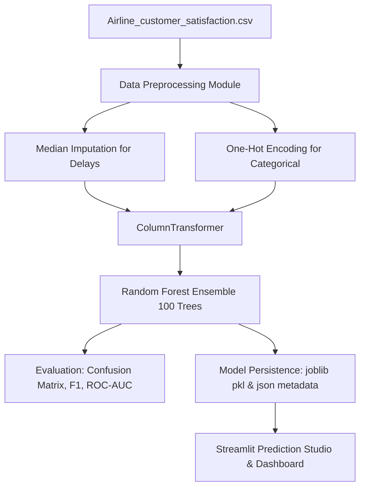

# ✈️ SkyPulse - Airline Customer Satisfaction Prediction

A production-ready Machine Learning web application and data pipeline built with **Python**, **Scikit-Learn**, and **Streamlit**. SkyPulse automatically ingests airline customer sentiment and flight performance data, builds an end-to-end preprocessing and ensemble learning pipeline using **Random Forest**, and provides an interactive web interface for real-time predictions and model exploration.

---

## 📌 Project Overview

Customer satisfaction is a pivotal driver of retention, brand reputation, and revenue in the aviation sector. SkyPulse enables airline operations and customer experience teams to:
- Automatically inspect and profile passenger feedback datasets.
- Train an optimized **Random Forest Classifier** achieving **~95.4% accuracy** on holdout test data.
- Explore passenger demographics, class preferences, flight delays, and inflight service ratings.
- Interactively predict customer satisfaction for individual passenger profiles with confidence scores and class probability distributions.

---

## 📊 Dataset Information

- **Dataset Source**: `Airline_customer_satisfaction.csv` (located in the project folder and `data/` directory).
- **Total Records**: 129,880 rows
- **Total Attributes**: 22 columns (1 Target + 21 Predictor features)
- **Target Variable**: `satisfaction`
  - `satisfied`: 71,087 records (54.7%)
  - `dissatisfied`: 58,793 records (45.3%)
- **Task Type**: Binary Classification

### Feature Breakdown:
1. **Passenger Demographics & Flight Attributes**:
   - `Customer Type`: Loyal Customer, disloyal Customer
   - `Age`: Passenger age (7 to 85 years)
   - `Type of Travel`: Business travel, Personal Travel
   - `Class`: Business, Eco, Eco Plus
   - `Flight Distance`: Flight distance in miles (50 to 5,000 miles)
2. **Inflight Experience Ratings (Scale 0 to 5)**:
   - `Seat comfort`, `Food and drink`, `Inflight entertainment`, `Cleanliness`, `Leg room service`
3. **Digital & Online Services (Scale 0 to 5)**:
   - `Inflight wifi service`, `Ease of Online booking`, `Online boarding`, `Online support`
4. **Airport & Ground Handling (Scale 0 to 5)**:
   - `Departure/Arrival time convenient`, `Gate location`, `On-board service`, `Baggage handling`, `Checkin service`
5. **Flight Delays**:
   - `Departure Delay in Minutes`
   - `Arrival Delay in Minutes` *(contains 393 missing values, automatically handled via Median Imputation)*

---

## ⚙️ Architecture & Machine Learning Pipeline

The project follows a scikit-learn pipeline architecture:



### Preprocessing Strategy:
- **Numerical Features (18)**: Missing values imputed using `SimpleImputer(strategy='median')`.
- **Categorical Features (3)**: Handled using `SimpleImputer(strategy='most_frequent')` followed by `OneHotEncoder(handle_unknown='ignore', sparse_output=False)`.
- **Uninformative / ID Features**: Automated detection and removal if columns lack predictive signals.
- **Train / Test Split**: 80% training / 20% testing with stratification on the target variable and fixed `random_state=42`.

---

## 🏆 Model Performance Summary

Evaluated on **25,976 holdout test passengers**:

| Metric | Score | Details |
|---|---|---|
| **Accuracy** | **95.43%** | Overall correct classifications |
| **Precision (Weighted)** | **95.48%** | Precision accounting for class proportions |
| **Recall (Weighted)** | **95.43%** | True positive detection rate |
| **F1-Score (Weighted)** | **95.43%** | Harmonic mean of precision & recall |
| **ROC-AUC** | **99.22%** | High class separability |

### Top 5 Predictive Features:
1. **Inflight entertainment**: Highest Gini importance reduction.
2. **Seat comfort**: Fundamental indicator of passenger physical comfort.
3. **Ease of Online booking**: Strong impact on customer pre-flight experience.
4. **Online support**: Critical service touchpoint.
5. **Food and drink**: Strong correlation with cabin service perception.

---

## 💻 Tech Stack

- **Language**: Python 3.10+ / 3.13
- **Machine Learning**: `scikit-learn`, `joblib`
- **Data Manipulation**: `pandas`, `numpy`
- **Visualization**: `plotly`, `matplotlib`, `seaborn`
- **Frontend / UI**: `streamlit`

---

## 📁 Project Structure

```text
Airlines/
│
├── data/
│   └── Airline_customer_satisfaction.csv     # Local dataset
│
├── models/
│   ├── random_forest_model.pkl               # Serialized trained scikit-learn pipeline
│   └── model_metadata.json                   # Model metrics, features & hyperparameters
│
├── src/
│   ├── __init__.py
│   ├── data_preprocessing.py                 # Ingestion, validation, cleaning & ColumnTransformer
│   ├── train_model.py                        # Model construction, hyperparameter tuning & training
│   ├── evaluation.py                         # Evaluation metrics, confusion matrix & feature importances
│   └── predict.py                            # Real-time inference engine & sample presets
│
├── app.py                                    # Streamlit web application
├── requirements.txt                          # Python package dependencies
├── run_app.bat                               # Windows 1-click launcher script
└── README.md                                 # Project documentation
```

---

## 🚀 Installation & Setup

### 1. Clone or Open Project Folder
Open your terminal in the `Airlines` project directory:
```bash
cd Airlines
```

### 2. Install Dependencies
Install all required libraries using `pip`:
```bash
pip install -r requirements.txt
```

---

## 🖥️ Running the Application

### Option 1: Double-Click (Windows)
Double-click [`run_app.bat`](file:///c:/Users/Student/Downloads/Airlines/run_app.bat) in the project folder to start the application automatically.

### Option 2: Command Line
Launch Streamlit using your Python environment:
```bash
streamlit run app.py
```
Or with specific Python interpreter:
```bash
python -m streamlit run app.py
```

Once started, the application will be available at:
👉 **`http://localhost:8501`**

---

## 🧭 Application Walkthrough

### 1. 📊 Dashboard
- Overview of key metrics: Total records (129,880), features, target column, and current model accuracy.
- Interactive donut chart of target class distribution.
- Top satisfaction drivers preview chart.
- System pipeline architecture summary.

### 2. 🔍 Dataset Explorer
- Interactive table preview with filtering by satisfaction status and travel class.
- Column-level metadata with types, missing counts, and unique value summaries.
- Descriptive statistics for both numerical and categorical variables.
- Interactive charts: Satisfaction by Class, Satisfaction by Customer Type, and Mean Service Ratings profile.

### 3. ⚙️ Model Training
- Hyperparameter tuning panel: customize `n_estimators`, `max_depth`, `min_samples_split`, `test_split`, and sample size.
- **"🚀 Train Random Forest Model"** button with live progress tracking.
- Test set performance KPI cards (Accuracy, Precision, Recall, F1, ROC-AUC).
- Interactive Confusion Matrix heatmap (Plotly) with percentage distributions.
- Formatted classification report table and full horizontal Feature Importance bar chart.

### 4. 🎯 Prediction Studio
- Dynamic input form organized into 5 intuitive sections:
  1. *Passenger Profile* (Customer Type, Age, Travel Type, Class, Flight Distance)
  2. *Inflight Experience* (Seat comfort, Inflight entertainment, Food & drink, etc.)
  3. *Digital & Online Experience* (WiFi, Online booking, Online support, Boarding)
  4. *Airport & Ground Services* (Time convenient, Gate location, Baggage, Checkin)
  5. *Flight Schedule & Delays* (Departure & Arrival delays in minutes)
- **⚡ 1-Click Quick Presets**:
  - `🌟 Happy Business Traveler`
  - `⚠️ Frustrated Economy Traveler`
  - `🎲 Random Sample from Dataset`
- Prominent **"🔮 Predict Customer Satisfaction"** button.
- Result card displays predicted status (Satisfied / Dissatisfied) with confidence percentage and a class probability breakdown chart.
